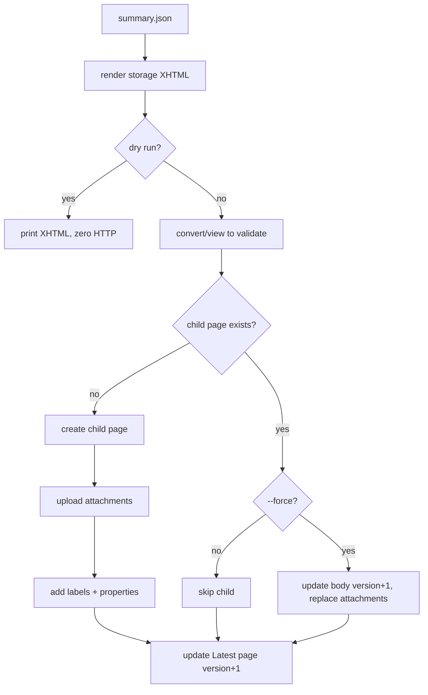

# Confluence Automation API

Back to [[confluence-hub]]. Cloud (`*.atlassian.net`) only; Data Center auth and paths differ.

> [!important] Stabilise before automating
> Freeze the page fields, status rules, link strategy and permissions first. Automation multiplies the cost of every later structural change.

## Auth

- Basic auth: account email + API token. Base URL `https://<site>.atlassian.net`.
- Use a service account so page history shows the bot, not a person, and tokens do not die when someone leaves.
- Keep the token in an environment variable (`DTRACK_CONFLUENCE_TOKEN`), never in config files committed to git.

### SSO sites

SAML SSO only governs browser login. REST calls do not go through the IdP; they authenticate with a token.

| Token | Where to create | Base URL | Header |
|---|---|---|---|
| Classic API token (Cloud) | id.atlassian.com → Security → API tokens | `https://<site>.atlassian.net/wiki/...` | Basic `email:token` |
| Scoped API token (Cloud) | same page → *Create API token with scopes* | `https://api.atlassian.com/ex/confluence/<cloudId>/wiki/...` | Basic `email:token` |
| Personal Access Token (Data Center) | Profile → Personal Access Tokens | `https://<host>/rest/api/...` (no v2) | `Authorization: Bearer <pat>` |

- `cloudId`: open `https://<site>.atlassian.net/_edge/tenant_info`.
- Org admins can block API token creation or use for managed accounts (Authentication policies). If token creation is greyed out, ask the admin for an exception or a service account.
- Scopes needed for dtrack: read/write page, read/write attachment, write label (granular names differ; pick the Confluence ones covering pages, attachments, labels).
- Do not reuse browser SSO cookies in scripts: they expire, break unattended runs, and usually violate policy.

Smoke test before writing any code:

```bash
curl -s -o /dev/null -w "%{http_code}\n" -u "$EMAIL:$DTRACK_CONFLUENCE_TOKEN" "https://<site>.atlassian.net/wiki/api/v2/spaces?limit=1"
```

`200` works; `401` token wrong or blocked by policy; `403` token fine, no space permission; `404` on `/api/v2` means Data Center (v2 is Cloud-only).

### No third-party packages

The standard library is enough; `requests` is a convenience, not a requirement.

```python
import base64
import json
import os
import urllib.request

def call(method: str, url: str, body: dict | None = None) -> dict:
    auth = base64.b64encode(f"{os.environ['EMAIL']}:{os.environ['DTRACK_CONFLUENCE_TOKEN']}".encode()).decode()
    data = json.dumps(body).encode() if body is not None else None
    req = urllib.request.Request(url, data=data, method=method, headers={"Authorization": f"Basic {auth}", "Accept": "application/json", "Content-Type": "application/json"})
    with urllib.request.urlopen(req, timeout=30) as resp:
        return json.loads(resp.read() or b"{}")

spaces = call("GET", "https://<site>.atlassian.net/wiki/api/v2/spaces?keys=DT")
```

Attachment upload needs a hand-built `multipart/form-data` body with `urllib`; it is about 15 lines, or use `requests` if it is already installed (it often is, as a transitive dependency).

## Python clients

| Option | Good for | Watch out |
|---|---|---|
| `atlassian-python-api` (`pip install atlassian-python-api`) | Fastest start; covers pages, attachments, labels, CQL search, Cloud and Data Center | Wraps mostly v1 REST; Atlassian keeps retiring v1 page endpoints on Cloud, so pin a version and test |
| `requests` + REST v2 directly | Full control, v2 endpoints, easy to mock in tests | You write pagination, retries and the v1 attachment call yourself |
| `md2cf` / `mark` | Publishing Markdown files as pages | Markdown → storage conversion is lossy for macros (status, details) |

```python
from atlassian import Confluence

confluence = Confluence(url="https://<site>.atlassian.net", username=email, password=api_token, cloud=True)
page = confluence.update_or_create(parent_id=parent_id, title=title, body=xhtml, representation="storage")
confluence.attach_file("out/orders_report.xlsx", name="orders_report.xlsx", page_id=page["id"])
confluence.set_page_label(page["id"], "dtrack-run")
hits = confluence.cql('label = "dtrack-run" and space = "DT" order by created desc', limit=10)
```

> [!tip] Which to pick
> Prototype and manual scripts: `atlassian-python-api`. Production publisher with tests (like `dtrack publish-confluence`): a thin `requests` client, as in [[#Minimal Python shape]], so you control endpoints, retries and mocks.

## Endpoints

| Task | Method + path | Notes |
|---|---|---|
| Space key → id | `GET /wiki/api/v2/spaces?keys=DT` | v2 wants numeric `spaceId` |
| Find page by title | `GET /wiki/api/v2/pages?space-id=&title=` | Title is unique per space |
| Read page body | `GET /wiki/api/v2/pages/{id}?body-format=storage` | Returns `version.number` |
| Create page | `POST /wiki/api/v2/pages` | `spaceId`, `parentId`, `title`, `status: current`, `body.representation: storage` |
| Update page | `PUT /wiki/api/v2/pages/{id}` | Send `version.number = current + 1` and a `version.message` |
| List children | `GET /wiki/api/v2/pages/{id}/children` | Paginated with `cursor` |
| List attachments | `GET /wiki/api/v2/pages/{id}/attachments` | Filter by `filename` |
| Upload attachment | `POST /wiki/rest/api/content/{id}/child/attachment` | v1; header `X-Atlassian-Token: nocheck`; multipart `file` |
| Replace attachment data | `POST /wiki/rest/api/content/{id}/child/attachment/{attId}/data` | Creates a new attachment version |
| Add labels | `POST /wiki/rest/api/content/{id}/label` | v1; body `[{"prefix":"global","name":"dtrack-run"}]` |
| Content property | `POST /wiki/api/v2/pages/{id}/properties` | JSON key/value on the page, invisible to readers |
| Validate storage XHTML | `POST /wiki/rest/api/contentbody/convert/view` | v1; body `{"value": xhtml, "representation": "storage"}`; 400 on malformed markup |

> [!warning] Re-check v1 endpoints at implementation time
> Atlassian keeps migrating v1 to v2. Attachment upload and labels were v1-only when these notes were written.

## Idempotent publish flow



Rules of thumb:

- **Find, then create or update.** Never blindly `POST`; a second run would fail with a duplicate-title error or, worse, create a near-duplicate under another title.
- **Compare before update.** If the source hash equals the one stored on the page, skip the `PUT`; no version bump, no watcher notification.
- **Immutable run pages.** Create once; only `--force` touches them.
- **Upload only what changed.** List attachments first; skip files whose name and size already match.
- **Sequential uploads** are fine for tens of files. Add retries, not concurrency.

## Handling errors

| Status | Meaning | Action |
|---|---|---|
| 400 | Bad XHTML or bad field | Run convert/view locally first; log the body |
| 401 / 403 | Token or space permission | Fail fast, do not retry |
| 404 | Wrong space id / parent id, or no view permission | Check the bot can see the parent page |
| 409 | Version conflict (someone edited) | Re-read version, re-render, retry once |
| 413 | Attachment too large | Skip with a warning and grey out the link |
| 429 | Rate limited | Sleep `Retry-After` seconds, exponential backoff with jitter |
| 5xx | Transient | Retry with backoff, max 3–5 times |

## Storage-format pitfalls

- Escape every dynamic string: pair names, column names, notes. `&`, `<`, `>` break the page.
- Wrap free text in `CDATA` inside `ac:plain-text-link-body` and `ac:plain-text-body`.
- Named HTML entities such as `&nbsp;` may be rejected; use `&#160;`.
- Self-close void tags: `<br/>`, `<hr/>`, `<time .../>`.
- `ri:content-title` links break when a page is renamed. Keep run page titles stable after creation.
- Attachment filenames must be unique per page; uploading the same name creates a new version, not a second file.
- The `html` macro is disabled by default on Cloud. Do not depend on it.
- Very large bodies make the editor sluggish for humans; keep generated pages to the summary layer.

## Small conveniences

- **Full width** from code: set page properties `content-appearance-published` and `content-appearance-draft` to `full-width` via the properties endpoint.
- **Version messages**: `"published by dtrack <version> for run <run_id>"`; shows up in page history and makes diffs auditable.
- **Content properties** (API) are not the same thing as the Page Properties macro (UI). Use API properties for machine state (`run_id`, `summary_sha256`) and the macro for reader-facing metadata.
- **Hash the source**: store `summary_sha256` as a content property; skip publishing when it is unchanged.
- **Dry run**: write the XHTML to a file and paste it into the editor's **Insert markup** dialog (format: Confluence storage) to eyeball rendering without touching the real page.

## Minimal Python shape

```python
import os
import requests

class Confluence:
    def __init__(self, site: str, email: str, token: str):
        self.base = f"https://{site}.atlassian.net/wiki"
        self.http = requests.Session()
        self.http.auth = (email, token)
        self.http.headers["Accept"] = "application/json"

    def find_page(self, space_id: str, title: str) -> dict | None:
        r = self.http.get(f"{self.base}/api/v2/pages", params={"space-id": space_id, "title": title})
        r.raise_for_status()
        results = r.json()["results"]
        return results[0] if results else None

    def upsert_page(self, space_id: str, parent_id: str, title: str, xhtml: str, message: str) -> dict:
        page = self.find_page(space_id, title)
        body = {"representation": "storage", "value": xhtml}
        if page is None:
            r = self.http.post(f"{self.base}/api/v2/pages", json={"spaceId": space_id, "parentId": parent_id, "status": "current", "title": title, "body": body})
        else:
            version = {"number": page["version"]["number"] + 1, "message": message}
            r = self.http.put(f"{self.base}/api/v2/pages/{page['id']}", json={"id": page["id"], "status": "current", "title": title, "body": body, "version": version})
        r.raise_for_status()
        return r.json()

    def upload(self, page_id: str, path: str, name: str) -> dict:
        with open(path, "rb") as fh:
            r = self.http.post(
                f"{self.base}/rest/api/content/{page_id}/child/attachment",
                headers={"X-Atlassian-Token": "nocheck"},
                files={"file": (name, fh)},
                data={"minorEdit": "true"},
            )
        r.raise_for_status()
        return r.json()
```

> [!caution] Do not diff the stored body
> Confluence normalises stored XHTML (attribute order, whitespace, macro ids), so comparing it with freshly rendered XHTML rarely matches. Compare a hash of your own rendered output, stored as a content property, instead.
